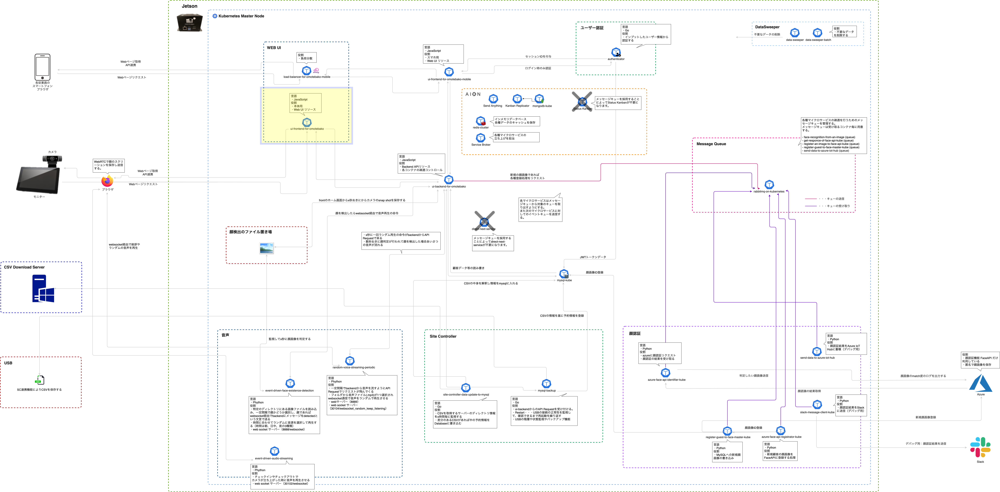

# ui-frontend-for-omotebako  
ui-frontend-for-omotebako は、Latonaが提供するエッジアプリケーション「OMOTE-Bako」のフロントエンドリソースです。  
ui-frontend-for-omotebako のアーキテクチャやソースコードを参照することで、次のことの参考になります。  

* 主にエッジコンピューティング環境において、どのようにして、効率よくUIフロントエンドリソースを稼働させるか  

* 主にエッジコンピューティング環境において、どのようにして、効率よくUIフロントエンドリソースを開発するか  

* 主にエッジコンピューティング環境において、洗練されたマイクロサービスアーキテクチャにUIフロントエンドのリソースがどのように組み込まれているか  

* 主にエッジコンピューティング環境において、どのようにして、リッチなアプリケーションUIフロントエンド体験を提供するか  

* 主にエッジコンピューティング環境において、どのようにして、先進的なソフトウェアアーキテクチャを実装するか  


## OMOTE-Bako のエッジコンピューティングアーキテクチャ  
ui-frontend-for-omotebakoは、下記の黄色い枠の部分のリソースです。  



## UIの一例   
下記の画像は、ui-frontend-for-omotebakoによる実際のUIの一例です。   


## ui-frontend-for-omotebakoの稼働環境   
・ ui-frontend-for-omotebakoは、エッジ環境上で稼働します。    
・ ui-frontend-for-omotebakoは、AIONならびに(または)Kubernetes上で稼働することができるマイクロサービスです。  
・ ui-frontend-for-omotebakoは、Latonaでは、Reactフレームワーク、Next.jsによって開発されています。  

## Getting Started　　
1.下記コマンドでDockerイメージを作成します。  　　
```
make docker-build
```
2.aion-service-definitions/services.yml に設定を記載し、AionCore経由でKubernetesコンテナを起動します。    
services.ymlへの記載例：     
```
  ui-frontend-for-omotebako:
    scale: 1
    startup: yes
    always: yes
    network: NodePort
    ports:
      - name: ui-frontend
        protocol: TCP
        port: 4000
        nodePort: 30040
    env:
      REACT_APP_PUBLIC_URL: 'http://localhost:4000/'
      REACT_APP_APIURL: 'http://localhost:30080/api/'
      REACT_APP_WEB_SOCKET_URL: 'ws://localhost:30099/'
      PORT: '4000'
      REACT_APP_IMAGE_PATH: 'http://localhost:30080/'
      REACT_APP_GRPCURL: 'http://localhost:30050'
```