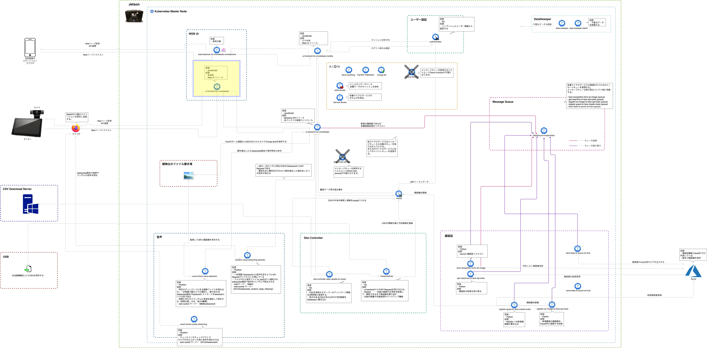
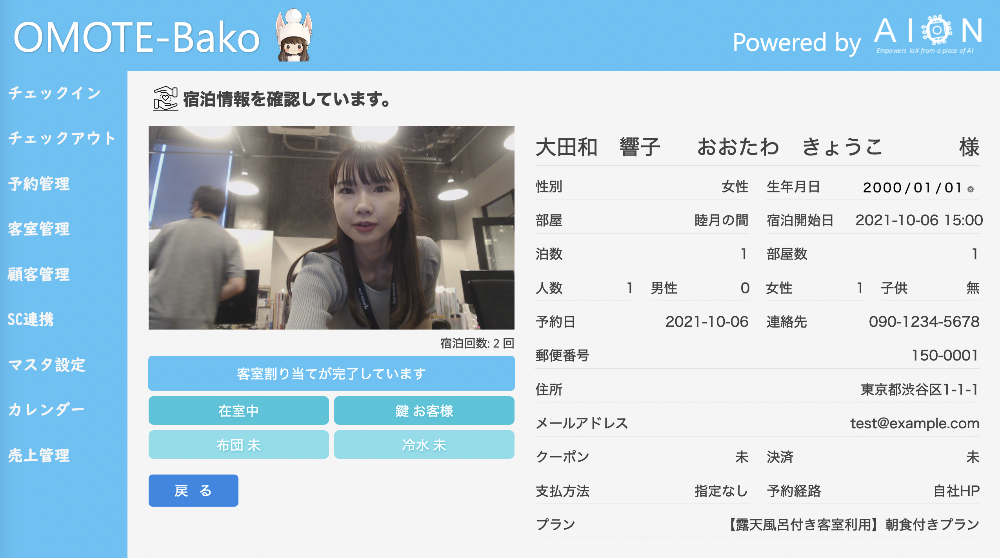
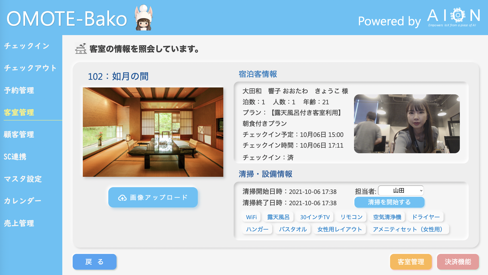

# ui-frontend-for-omotebako  
ui-frontend-for-omotebakoは、Latonaが提供するエッジアプリケーション「OMOTE-Bako」のフロントエンドリソースです。   
本リポジトリのソースコードはGithub上では公開されておりませんが、ここではOMOTE-Bakoのエッジコンピューティングアーキテクチャと実際のエッジUI画面の一部を紹介します。　　　

## OMOTE-Bako のエッジコンピューティングアーキテクチャ  
ui-frontend-for-omotebakoは、下記の黄色い枠の部分のリソースです。  

## UIの一例   
下記の画像は、ui-frontend-for-omotebakoによる実際のUIの一例です。   

## ui-frontend-for-omotebakoの稼働環境   
・ ui-frontend-for-omotebakoは、エッジ環境上で稼働します。    
・ ui-frontend-for-omotebakoは、 AIONならびに(または)Kubernetes上で稼働することができるマイクロサービスです。  
・ ソースコードは非公開ですが、Latonaでは、Reactフレームワーク、Next.jsによって開発されています。  

